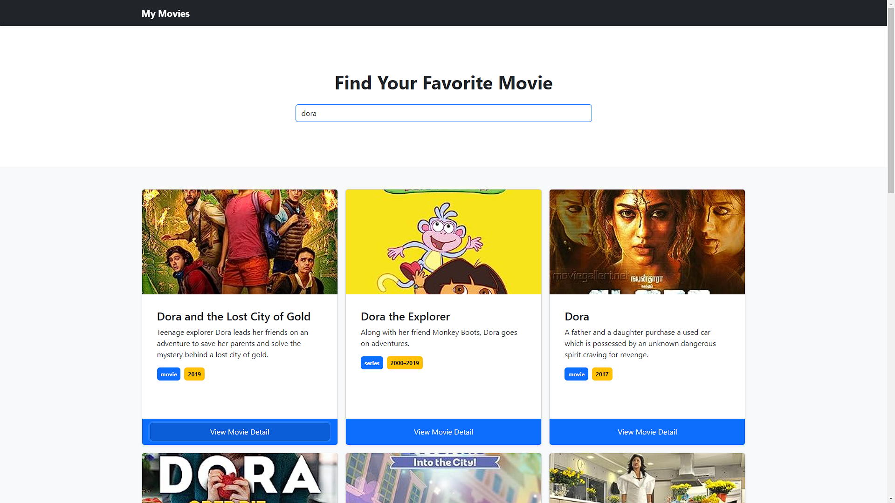
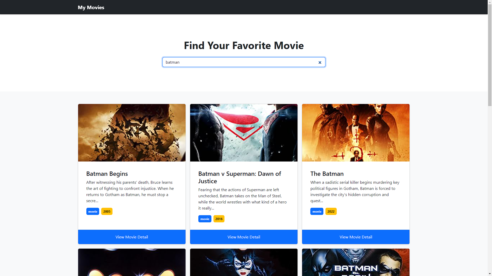
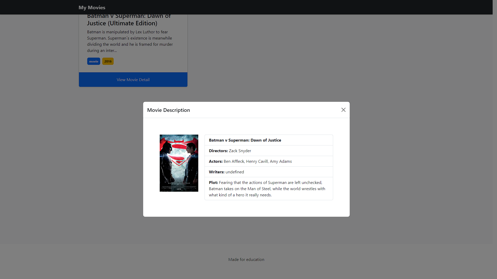

# Movie Album
This is an example of implementing live search using asyncronous concepts in Javascript. The API is obtained from the web [OMDBAPI](http://www.omdbapi.com/). In this project, I used JQuery to make it easier to get APIs and bootstrap to provide attractive visuals.

## Feature
Every time you type a keyword into the search field, the data will be searched without having to press the search button.

## Screenshots

## References
- [JAVASCRIPT LANJUTAN | 10.2 Callback (Latihan)](https://youtu.be/jRsSVw3Ibhw?si=8JFhcHzu66ZM7Zpx)